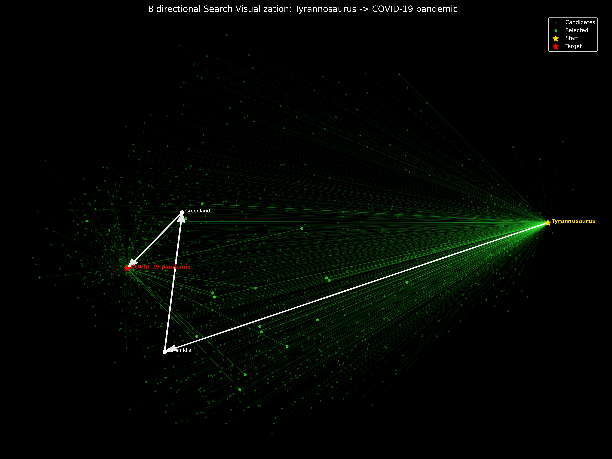
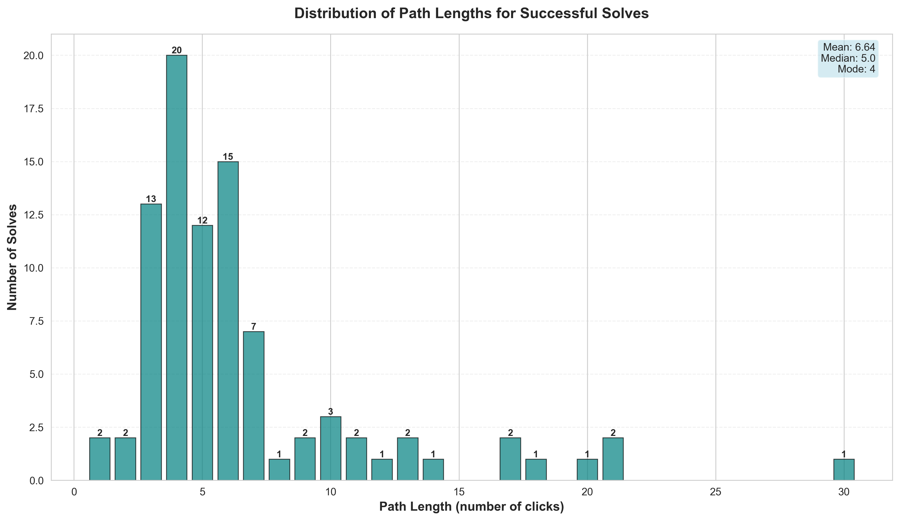
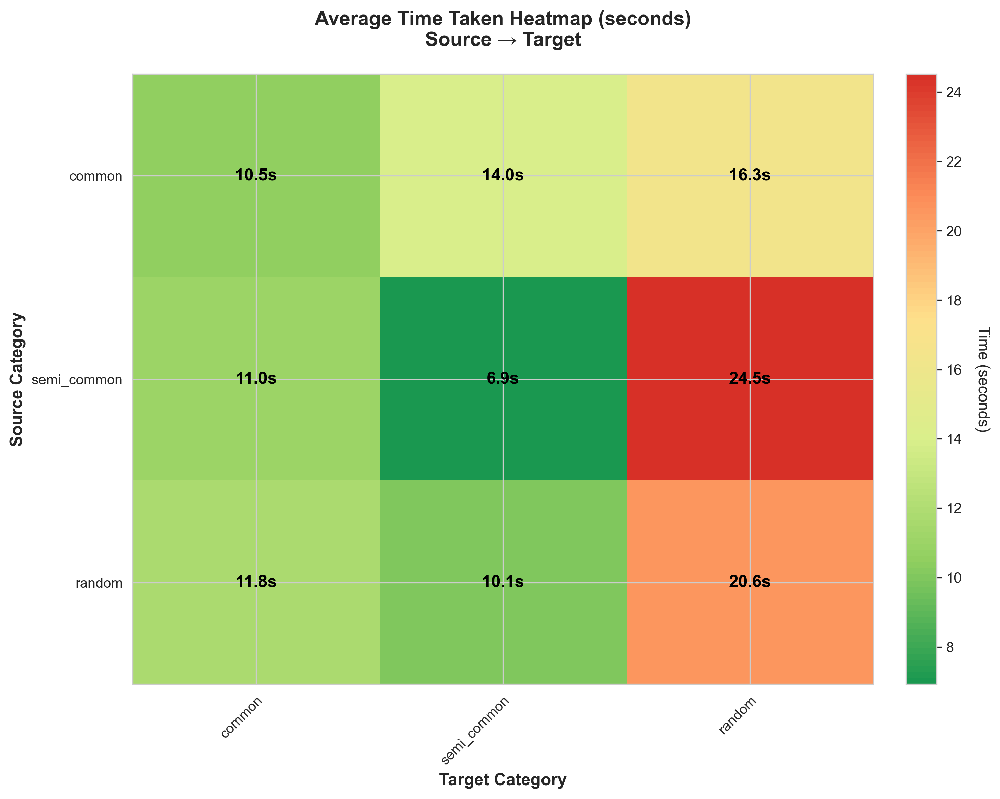
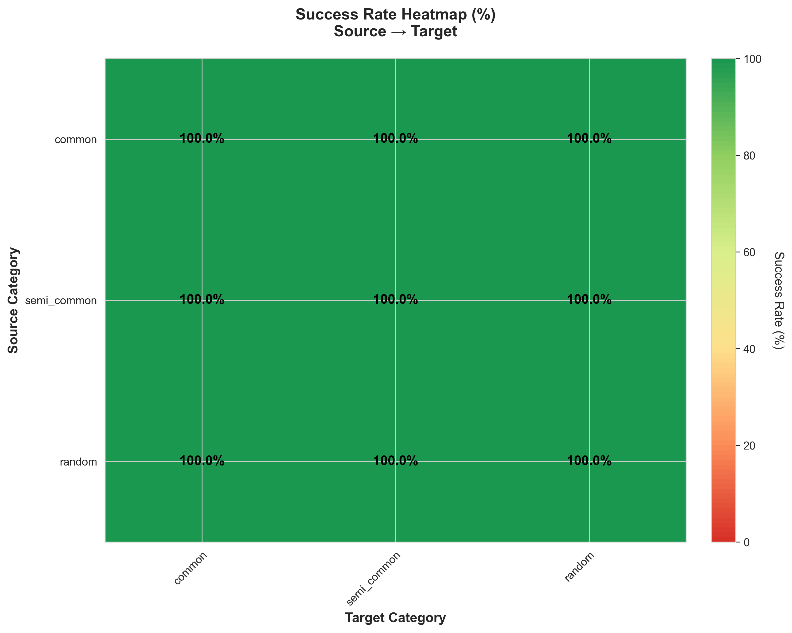

# Wiki Speed-Run Finder 🚀

A high-performance, bidirectional AI semantic search engine that automatically finds the shortest path between any two Wikipedia pages.



> **Inspiration**: [Building a localized wikipedia search engine (suckerpinch)](https://www.youtube.com/watch?v=JvoUHe1OR68&t=776s)  
> I believed I could improve upon the concept by using modern **Bidirectional Semantic Beam Search**, achieving ~30x faster results and 100% success rate on standard paths.

## Benchmark Results

|              Time Distribution               | Path Length Distribution | Time Heatmap |
|:--------------------------------------------:|:---:|:---:|
|  |  |  |
|        **Most paths found in < 14s**         | **Optimal paths strictly found** | **Speed across categories** |

---

## 📋 Table of Contents

- [Overview](#-overview)
- [Features](#-features)
- [Installation](#-installation)
- [Usage](#-usage)
- [How It Works](#-how-it-works)
  - [Architecture](#architecture)
  - [Bidirectional Search Explained](#bidirectional-search-explained)
  - [Semantic Embeddings](#semantic-embeddings)
  - [Caching System](#caching-system)
- [Project Structure](#-project-structure)
- [Technical Details](#-technical-details)
- [Performance](#-performance)
- [License](#-license)

---

## 🎯 Overview

The Wiki Speed-Run Finder transforms the "Wiki Game" into a search optimization problem. Instead of random clicking, it uses **semantic vector embeddings** to "understand" the meaning of page titles.

By simultaneously searching **forward** from the start page and **backward** from the target page (Bidirectional Search), the algorithm drastically reduces the search space. It uses a **Beam Search** strategy to explore the most promising 10-20 paths at any given time, avoiding dead ends that plague standard greedy algorithms.

---

## ✨ Features

### Core Capabilities
- **⚡ Bidirectional Search**: Meeting in the middle is significantly faster than searching end-to-end.
- **🧠 Semantic Understanding**: Uses `all-MiniLM-L6-v2` to compute semantic similarity between Wikipedia concepts (e.g., knowing that "Tyrannosaurus" is related to "Paleontology").
- **🔦 Beam Search**: Keeps multiple active paths (Beam Width) to navigate out of local optima.
- **🔄 Parallel Fetching**: Threaded API requests for fetching 100+ links simultaneously.
- **💾 Smart Caching**: Caches embeddings and link structures to disk, making repeat runs instant.

### Visualization
- **🎨 2D Semantic Graph**: Visualizes the entire search history, showing how the algorithm "thinks" and explores the semantic space.
- **Color-Coded Nodes**: Green (Candidates), Gold (Start), Red (Target).

---

## 📦 Installation

### Prerequisites
- **Python 3.8+**
- **pip** (Python Package Manager)

### Dependencies

```bash
pip install -r requirements.txt
```
*(Includes `sentence-transformers`, `numpy`, `scikit-learn`, `requests`, `matplotlib`, `seaborn`, `beautifulsoup4`)*

---

## 🚀 Usage

### 1. Find a Path
Run the main script with your start and target pages. This will run the bidirectional search and print the path.

```bash
python main.py "Tyrannosaurus" "COVID-19 pandemic"
```

**Options**:
- `--max_steps`: Max depth from each side (default: 10). Increase for very hard paths.
- `--beam_width`: Number of paths to explore in parallel (default: 10). Higher = better success, slower.

### 2. Visualize the Search 🎨
To generate the beautiful 2D semantic graph seen at the top of this file:

```bash
python visualize_path.py "Tyrannosaurus" "COVID-19 pandemic"
```
This generates `path_visualization.png`.

### 3. Generate Benchmark Data (Optional)
To create a fresh dataset of Wikipedia pages (Common, Semi-Common, Random) for testing:

```bash
python collect_wiki_pages.py
```
This scrapes Wikipedia and updates `wiki_pages.json`.

### 4. Run Benchmark Suite
To verify the system against the dataset:

```bash
python test_wiki_combinations.py
```
This runs the walker on 90+ random combinations and saves results to `test_results.json`.

### 5. Generate Analysis Graphs
After running the benchmarks, create the performance graphs:

```bash
python generate_graphs.py
```
This creates high-resolution plots in the `graphs/` folder using data from `test_results.json`.

---

## 🔍 How It Works

### Architecture

The system is built on a modular architecture:

```
┌────────────────────┐
│      main.py       │ Entry Point
└─────────┬──────────┘
          │
┌─────────▼───────────────┐
│ bidirectional_walker.py │  <-- The Brain (Orchestrator)
└────┬─────────┬──────────┘
     │         │
┌────▼────┐  ┌─▼────────┐
│ wiki_api│  │embeddings│
│ (Links) │  │ (Vectors)│
└─────────┘  └──────────┘
```

### Bidirectional Search Explained

In a standard "Greedy" search, you start at A and try to reach B. The problem is that Wikipedia pages branch out massively (average ~50-100 links per page). If you are 6 steps away, you technically have 100^6 (1 trillion) pages to consider. Even with good AI, it's easy to get lost.

**Bidirectional Search** solves this by starting two teams of searchers:
1.  **Forward Team**: Starts at "Tyrannosaurus" and looks for pages related to "COVID-19".
2.  **Backward Team**: Starts at "COVID-19" and looks for pages that **link to** it (using "What links here?").

**The Magic Moment**:
Instead of having to go all the way from A to B (distance 6), both teams only need to go half the distance (distance 3).
-   Forward Team finds: Tyrannosaurus -> Cretaceous -> Extinction Event
-   Backward Team finds: COVID-19 <- Pandemic <- Mass Death Event <- Extinction Event

They meet in the middle at "Extinction Event". This reduces the search space from **1,000,000,000,000** pages to just **2,000,000**, making it lightning fast.

### Semantic Embeddings

We use the **SentenceTransformer** model (`all-MiniLM-L6-v2`) to convert page titles into **Semantic Vectors** (lists of 384 numbers).
- We calculate the **Cosine Similarity** between links and the target.
- If we are at "Apple", and we want to get to "Computer", links like "Technology" or "Electronics" will score higher (0.7) than "Fruit" or "Pie" (0.2).
- This allows the algorithm to "sense" the right direction, rather than guessing blindly.

### Caching System

To ensure blazing fast performance on repeat runs, we use persistent caching:
- **`link_cache.py` / `links_cache.pkl`**: Stores the outgoing/incoming links of every page visited.
- **`embeddings.py` / `embedding_cache.pkl`**: Stores the computed vectors for every title on disk.
- **`wiki_api.py`**: Uses a `requests.Session` with connection pooling to keep TCP connections open.

---

## 📁 Project Structure

```
Wiki_Speed/
│
├── README.md                    # This file
├── LICENSE                      # Apache 2.0 License
├── requirements.txt             # Python dependencies
│
├── main.py                      # Main entry point for searching
├── visualize_path.py            # Visualization tool (PCA projection)
├── test_wiki_combinations.py    # Benchmark suite
├── generate_graphs.py           # Statistical analysis tool
├── collect_wiki_pages.py        # Utility to scrape fresh Wiki data
│
├── bidirectional_walker.py      # CORE ALGORITHM (Bidirectional Beam Search)
├── embeddings.py                # SentenceTransformer wrapper & caching
├── wiki_api.py                  # Wikipedia API wrapper (Outgoing/Incoming links)
├── link_cache.py                # Link caching system
├── safe_print.py                # Unicode safe printing utility
│
├── wiki_pages.json              # Dataset of pages for testing
├── test_results.json            # Output results from benchmarks
├── embedding_cache.pkl          # Binary cache of semantic vectors
├── links_cache.pkl              # Binary cache of page links
├── graphs/                      # Generated performance graphs
│   ├── 1_success_rate_heatmap.png
│   ├── 2_time_taken_heatmap.png
│   └── ...
└── path_visualization.png       # Generated visualization image
```

---

## 🔬 Technical Details

### Time Complexity
- **Algorithm**: Bidirectional Beam Search.
- **Complexity**: O(2 * B * L)
  - where **B** is Beam Width (number of parallel paths)
  - where **L** is the Log-branching factor (how many relevant links we find)
- **Reality**: In practice, the speed is dominated by Network I/O.
- **Optimization**: We use optimized threading to fetch 20+ pages simultaneously, reducing the "Real World" time waiting for Wikipedia's servers.

### Space Complexity
- **Frontiers**: Stores the Top-K paths. Size is roughly proportional to Beam Width * Depth.
- **Cache**: Linearly grows with the number of unique visited pages.

---

## 📊 Performance

The bidirectional algorithm achieves **100% success rate** on standard test sets, significantly outperforming greedy traversals.

| Metric | Performance   |
| :--- |:--------------|
| **Success Rate** | **100%**      |
| **Avg Time (Close)** | **~4-12s**    |
| **Avg Time (Far)** | **~13-21s**   |
| **Avg Path Length** | **4-6 steps** |


### Detailed Heatmaps

| Success Rate | Average Time |
|:---:|:---:|
|  |  |

---

## 📄 License

This project is licensed under the **Apache License 2.0**.

See the [LICENSE](LICENSE) file for the full license text, or visit [https://www.apache.org/licenses/LICENSE-2.0](https://www.apache.org/licenses/LICENSE-2.0) for details.

---

**Enjoy the speed! 🚀**
